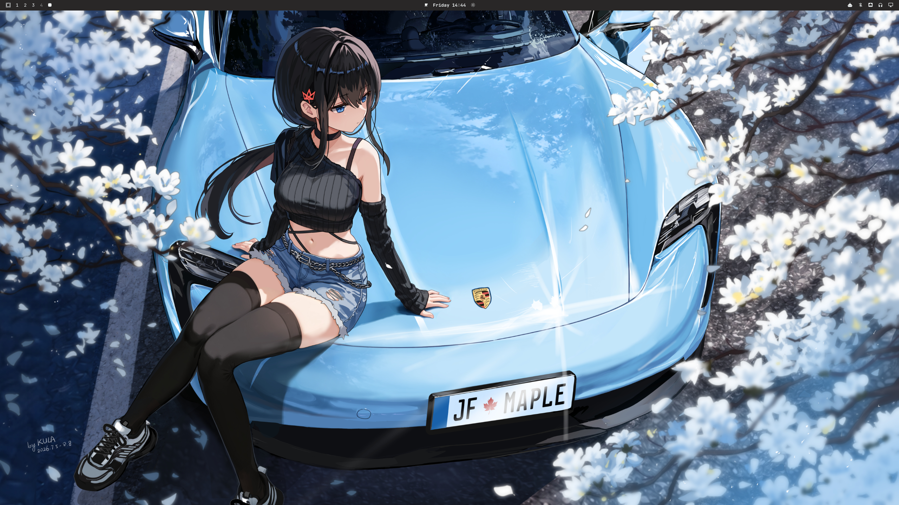
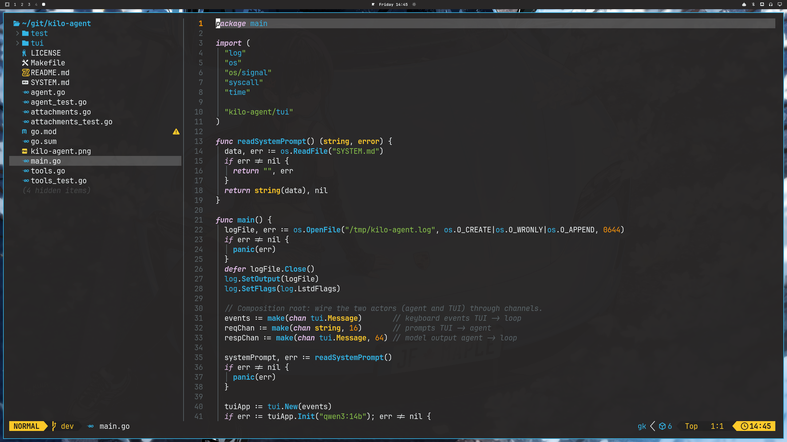
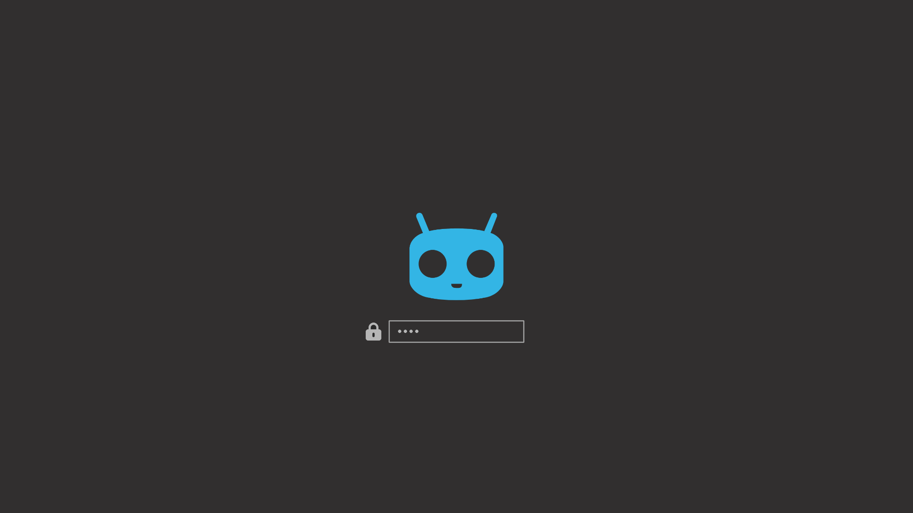
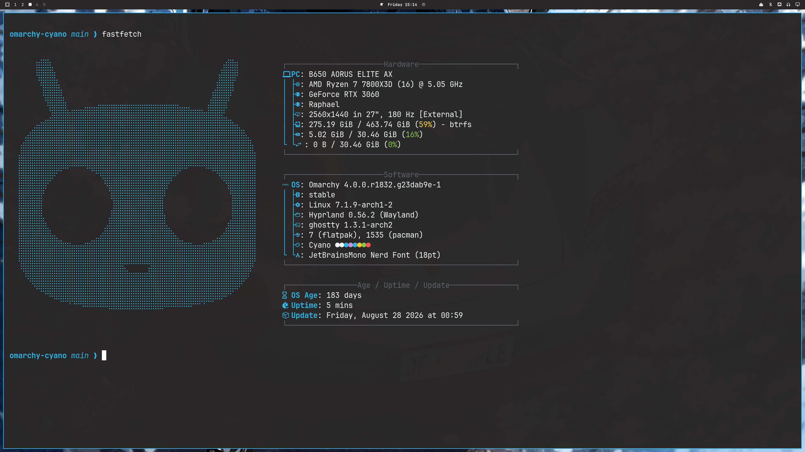

# Omarchy Cyano

> A dark, high-contrast Omarchy theme inspired by the CyanogenMod 11 Android ROM theme.


`#omarchy` `#hyprland` `#quickshell` `#cyanogenmod` `#archlinux` `#dark-theme`

Cyano pairs the classic CyanogenMod cyano accent (`#33b5e5`) with a deep charcoal base (`#292727`). It includes custom wallpapers, a Cyanogen-style lock screen, cyan launcher focus states, and an optional bold QuickShell clock widget.










## Install

Install the theme with Omarchy:

```bash
omarchy theme install https://github.com/davide-ferrara/omarchy-cyano.git
omarchy theme set omarchy-cyano
```

The theme includes the following:

- Cyan accent color: `#33b5e5`
- Charcoal background: `#292727`
- Five cyano-styled wallpapers
- Cyanogen-style unlock and preview artwork
- Cyan QuickShell menu/launcher selection states with white selected text
- Larger bar icons and an optional bold clock widget

## Optional bold QuickShell clock

Copy the user-owned clock plugin, then update the clock id in `~/.config/omarchy/shell.json` from `omarchy.clock` to `dff.clock` (including `bar.centerAnchor`). Restart QuickShell afterwards.

```bash
THEME_DIR="$(omarchy theme dir omarchy-cyano)"
mkdir -p ~/.config/omarchy/plugins
cp -r "$THEME_DIR/plugins/dff.clock" ~/.config/omarchy/plugins/
omarchy restart shell
```

## Contributing

Contributions are welcome. Feel free to open an issue or pull request for wallpaper additions, palette refinements, QuickShell polish, or documentation improvements.

## Credits

Inspired by the visual language of the CyanogenMod 11 Android ROM theme. CyanogenMod and related marks belong to their respective owners.
